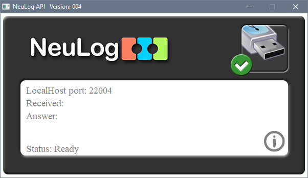
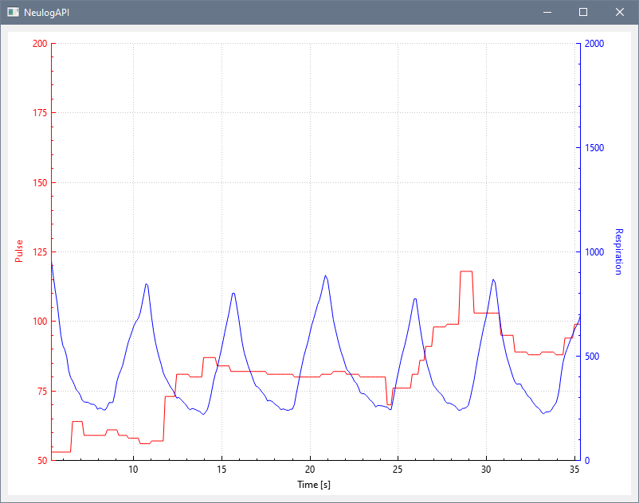

# NeulogAPI Qt project
Example application to fetch and visualize data from NeuLog sensors

## Install and run NeuLog API

1. Download and install the NeuLog API here https://neulog.com/software/
2. Connect USB module to PC
3. Run Neulog API
4. Connection should be established automatically

## Overview:

This is a Qt-based application designed to visualize live data from sensors named "Pulse" and "Respiration." The application periodically fetches data from a web API and displays it in real-time on a customizable graph. The project is designed to run on Windows 10 and utilizes Qt for the user interface and data visualization.

## Features:

- Fetches live sensor data from a web API.
- Visualizes the data using the QCustomPlot library.
- Real-time plotting of Pulse and Respiration sensor values.
- Customizable appearance with axis labels and titles.

## Usage:

- Build and run the application.
- The application will periodically fetch sensor data and display it on the graph.
- Use the "Fetch Data" button to manually trigger data updates.

## Requirements:

- Qt 5.x or later.
- Windows 10.
- Psapi.lib for process enumeration (included in Windows SDK).

## Note:

Ensure that you have Qt installed and configured properly in your development environment. Make sure to link against the "Psapi.lib" library as described in the project setup.

## Author:

Johann Fuchs

## License:

This project is open-source and available under the [Apache 2.0](https://www.apache.org/licenses/LICENSE-2.0.txt), allowing for free use and modification.
